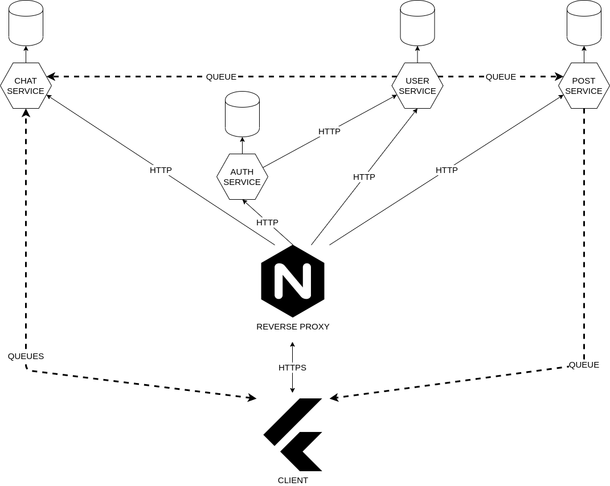
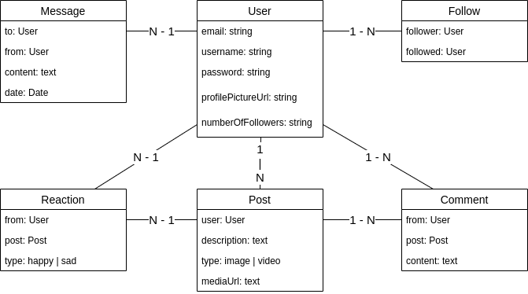

# Instagram Clone

## Overview
- Instagram-like application with more limited functionality
- Microservice architecture
- Node.js with TypeScript for services
- Flutter for mobile application
- University project

## Functionalities

1. **As** a user, **I would like to** log in via an email and a password, and logout.
2. **As** a user, **I would like to** register and account via an email and a password.
3. **As** a user, **I would like to** create posts.
   - A post consists of text (and maybe an image).
4. **As** a user, **I would like to** follow/un-follow other users.
   - A user will receive a notification for every new follow.
5. **As** a user, **I would like to** write private messages to other users.
   - Chat-like messaging.
6. **As** a user, **I would like to** react to other users' posts.
7. **As** a user, **I would like to** receive a notification for every new post by a user that I follow.
8. **As** a user, **I would like to** receive a notification for every reaction that my posts receive.
9. **As** a user, **I would like to** comment on my or other people's posts.
10. **As** a user, **I would like to** receive a notification for every new comment on my posts.

- Probably not all functionalities will be implemented by the deadline, depends on the available time.

## Architecture

## Entities

## Technology stack

- Client
  - Flutter: multi-platform SDK for creating mobile/web/desktop applications
  - Target platform: Android
- Backend
  - Nodejs
  - TypeScript
  - Docker
  - Rabbitmq for service communication
  - Microservices
